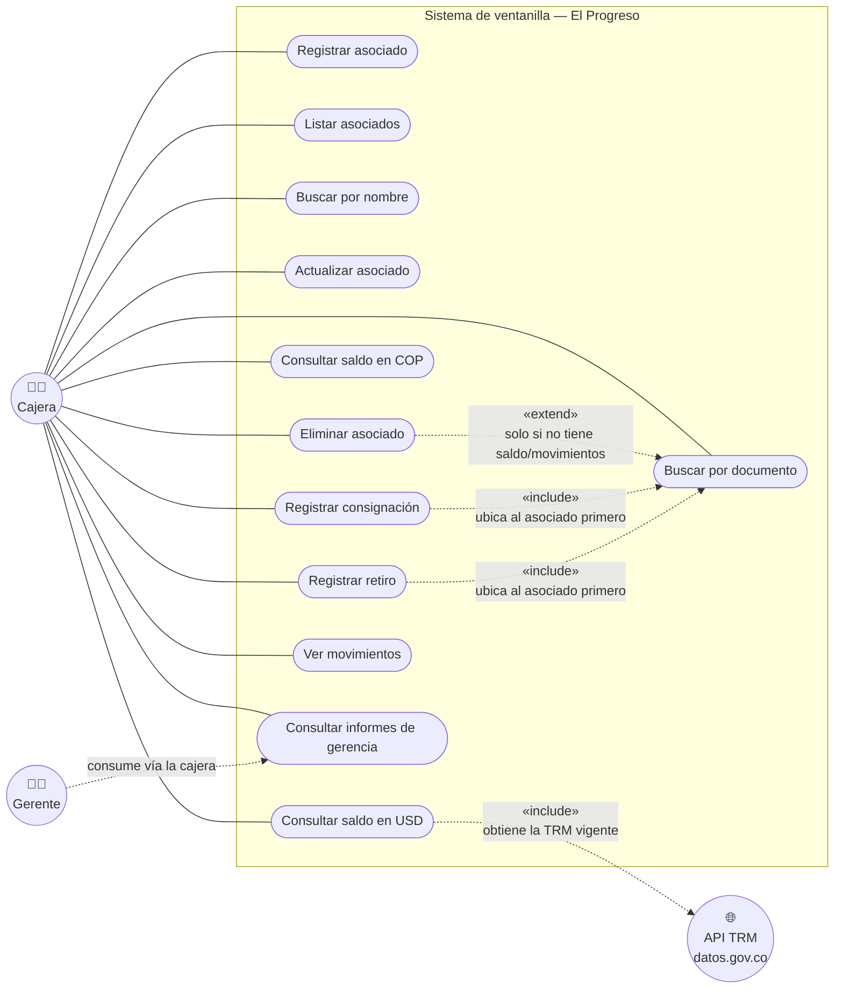

# Diagrama de casos de uso

**Norma:** 220501095 — Evidencia 2 (Diagramas UML)

Actor principal: **Cajera** — es la única persona que opera el sistema (el asociado nunca lo toca directamente, según el enunciado del cliente). Actor secundario no humano: **API TRM**, consultada por el caso de uso "Consultar saldo en dólares". El **Gerente** consume los informes de forma indirecta, a través de la cajera.

## Descripción de los casos de uso

| Caso de uso | Actor | Precondición | Flujo principal | Excepciones |
|---|---|---|---|---|
| Registrar asociado | Cajera | El documento no debe existir aún | Cajera ingresa documento, nombre, teléfono (opcional), dirección (opcional) → el sistema crea el asociado con saldo $0 | Documento repetido, formato de documento/nombre/teléfono inválido |
| Buscar por documento / por nombre | Cajera | — | Cajera ingresa el criterio → el sistema devuelve el/los asociado(s) coincidentes | Sin coincidencias |
| Actualizar asociado | Cajera | El asociado debe existir | Cajera modifica nombre/teléfono/dirección (el documento no se puede cambiar) | Asociado no encontrado, datos inválidos |
| Eliminar asociado | Cajera | El asociado no debe tener saldo ni movimientos | Cajera confirma la eliminación → el sistema lo remueve | Asociado con saldo o movimientos → se rechaza |
| Consultar saldo en COP | Cajera | El asociado debe existir | Se muestra el saldo actual | Asociado no encontrado |
| Consultar saldo en USD | Cajera | El asociado debe existir | El sistema consulta la TRM vigente (async) y convierte el saldo | Asociado no encontrado; TRM no disponible → se informa y no se interrumpe el sistema |
| Registrar consignación | Cajera | El asociado debe existir | Cajera ingresa el valor → se suma al saldo | Valor ≤ 0, asociado no encontrado |
| Registrar retiro | Cajera | El asociado debe existir y tener saldo suficiente | Cajera ingresa el valor → se resta del saldo, con comisión si supera $1.000.000 | Valor ≤ 0, saldo insuficiente (incluyendo comisión), asociado no encontrado |
| Ver movimientos | Cajera | El asociado debe existir | Se lista el historial completo con saldo corriente | Asociado no encontrado |
| Consultar informes de gerencia | Cajera (por el Gerente) | Debe haber datos registrados para que el informe no salga vacío | Se elige uno de los 6 informes y se muestra calculado en el momento | Rango de fechas inválido (informe por periodo) |
