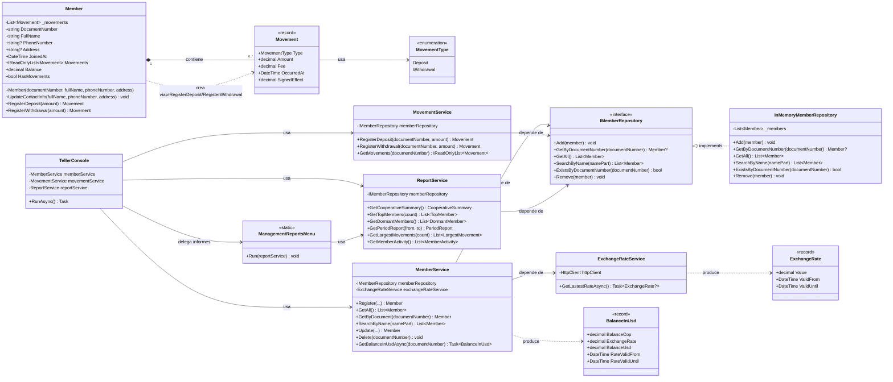

# Diagrama de clases

**Norma:** 220501095 — Evidencia 2 (Diagramas UML)

Este diagrama es la versión Mermaid (texto versionable) del diagrama de clases del modelo implementado. La versión oficial hecha en Draw.io, con el mismo contenido, está en [`docs/ElProgreso-Class-Diagram.drawio`](../../docs/ElProgreso-Class-Diagram.drawio) y su export en [`docs/ElProgreso-Class-Diagram.drawio.pdf`](../../docs/ElProgreso-Class-Diagram.drawio.pdf).

## Multiplicidades y relaciones clave

- **`Member` 1 — 0..\* `Movement`**: composición. Un asociado tiene cero o muchos movimientos; un movimiento no existe sin un asociado dueño, y solo `Member` puede crearlos (`_movements` es una lista privada). Si se elimina el `Member`, sus `Movement` dejan de existir con él — coherente con la regla de negocio "no se puede eliminar un asociado con movimientos" (nunca hay `Movement` huérfanos que borrar).
- **`IMemberRepository` ◁┄┄ `InMemoryMemberRepository`**: realización de interfaz. Es la relación que permite inversión de dependencias: `MemberService`, `MovementService` y `ReportService` dependen de la interfaz, no de la implementación en memoria.
- **`MemberService` → `ExchangeRateService`**: dependencia de uso (inyectada por constructor), no de composición — `ExchangeRateService` se instancia una sola vez en `Program.cs` y se comparte.
- **`Movement` → `MovementType`**: dependencia simple; el `enum` solo distingue el tipo de movimiento y determina el signo de `SignedEffect`.
