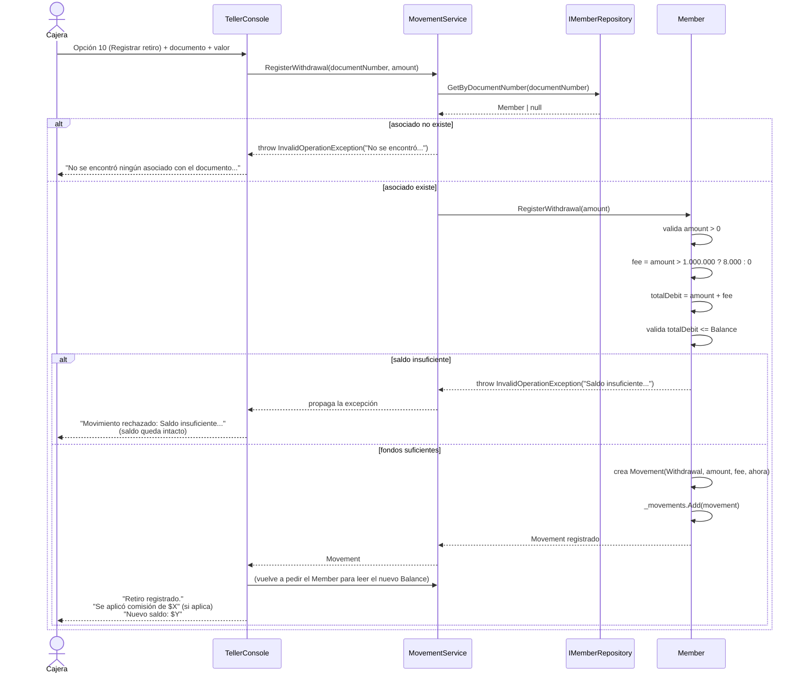
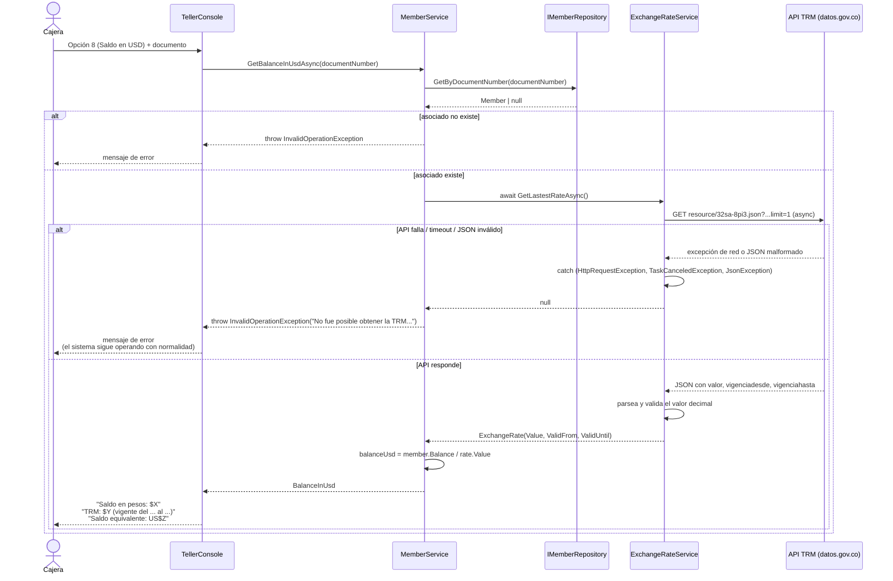

# Diagrama de secuencia

**Norma:** 220501095 — Evidencia 2 (Diagramas UML)

Se documentan los dos flujos con más lógica de negocio y más valor para explicar en la sustentación: **registrar un retiro** (con comisión y rechazo por saldo insuficiente) y **consultar el saldo en dólares** (consumo asíncrono de la TRM, con manejo de falla).

## 1. Registrar un retiro

**Puntos a resaltar en la sustentación:** la validación de fondos ocurre **dentro de `Member`**, no en `MovementService` ni en la UI — así ningún otro punto de entrada al sistema puede saltarse la regla. Si el retiro se rechaza, el método lanza la excepción *antes* de tocar `_movements`, por lo que el saldo queda exactamente igual que antes del intento (cumple "un movimiento rechazado no se ejecuta ni se registra").

## 2. Consultar saldo en dólares (TRM)

**Puntos a resaltar en la sustentación:** `ExchangeRateService.GetLastestRateAsync` **nunca propaga una excepción** — el `try/catch` interno la absorbe y devuelve `null`. Es `MemberService` quien decide qué significa ese `null` para el negocio (no se puede convertir el saldo) y lo traduce en una excepción de dominio con el mensaje que debe leer la cajera. Esa separación es la que garantiza que una caída de la API externa jamás tumbe la aplicación completa.
