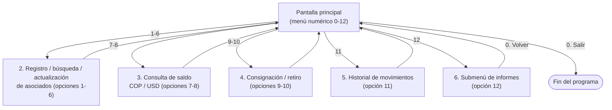

# Prototipo de solución de software (wireframes)

**Norma:** 220501095 — Evidencia 3

El sistema es una **aplicación de consola**, así que su "interfaz" es texto por diseño — no hay botones ni ventanas que maquetar en Figma. Por eso los wireframes de este anexo son mockups textuales de cada pantalla tal como aparecerá en la terminal: representan fielmente la navegación y el diseño de la información que verá la cajera, que es el objetivo real de un wireframe (mostrar diseño de interfaces, navegación y experiencia de usuario antes de programar).

## 1. Pantalla principal (menú)

```
┌──────────────────────────────────────────────────────────┐
│ Cooperativa Financiera El Progreso                        │
│ Sistema de ventanilla para asociados                      │
│                                                             │
│ ¿Qué necesita hacer?                                       │
│  1. Registrar un nuevo asociado                            │
│  2. Listar todos los asociados                             │
│  3. Buscar un asociado por documento                       │
│  4. Buscar un asociado por nombre                          │
│  5. Actualizar los datos de un asociado                    │
│  6. Eliminar un asociado                                   │
│  7. Consultar saldo                                        │
│  8. Consultar saldo en dólares (TRM)                       │
│  9. Registrar consignación                                 │
│ 10. Registrar retiro                                       │
│ 11. Ver los movimientos de un asociado                     │
│ 12. Consultar informes de gerencia                         │
│  0. Salir                                                   │
│                                                             │
│ Seleccione una opción: _                                   │
└──────────────────────────────────────────────────────────┘
```

## 2. Gestión de asociados — Registro (formulario)

```
┌──────────────────────────────────────────────────────────┐
│ Número de documento: _                                     │
│  ↳ si está vacío o repetido → "Este dato es obligatorio,  │
│    intente de nuevo." / "Ya existe un asociado con..."     │
│ Nombre completo: _                                          │
│ Teléfono (Enter para omitir): _                             │
│ Dirección (Enter para omitir): _                             │
│                                                              │
│ > Asociado registrado. Juan Pérez queda con la cuenta      │
│   en $ 0.                                                    │
└──────────────────────────────────────────────────────────┘
```

## 3. Gestión de asociados — Ficha / detalle (buscar por documento)

```
┌──────────────────────────────────────────────────────────┐
│ Número de documento: 1234567                                │
│                                                              │
│ Documento: 1234567                                           │
│ Nombre: Juan Pérez                                           │
│ Telefono: 3001234567                                         │
│ Direccion: (sin registrar)                                   │
│ Asociado desde: 01/09/2026                                   │
│ Saldo actual: $ 400.000                                      │
└──────────────────────────────────────────────────────────┘
```

## 4. Gestión de movimientos — Consignación / retiro

```
┌──────────────────────────────────────────────────────────┐
│ Número de documento: 1234567                                 │
│ Valor a retirar: 2000000                                     │
│                                                              │
│ > Movimiento rechazado: Saldo insuficiente: el retiro de   │
│   2.000.000 más la comisión de manejo de efectivo de       │
│   8.000 deja el saldo en negativo.                          │
│   (el saldo NO cambió)                                       │
└──────────────────────────────────────────────────────────┘
```

## 5. Historial de movimientos

```
┌──────────────────────────────────────────────────────────┐
│ Número de documento: 1234567                                 │
│                                                              │
│ 2 movimiento(s) de Juan Pérez:                                │
│   01/09/2026 14:31  Consignación  $ 500.000  saldo: $500.000 │
│   01/09/2026 14:31  Retiro        $ 100.000  saldo: $400.000 │
└──────────────────────────────────────────────────────────┘
```

## 6. Submenú — Informes de gerencia

```
┌──────────────────────────────────────────────────────────┐
│ Informes de gerencia:                                        │
│ 1. ¿Cuánta plata tenemos?                                     │
│ 2. ¿Quiénes son mis mejores asociados?                        │
│ 3. ¿Quiénes están dormidos?                                   │
│ 4. ¿Cómo nos fue en un periodo?                                │
│ 5. ¿Cuáles fueron los movimientos más grandes?                 │
│ 6. ¿Quién me esta moviendo la caja?                            │
│ 0. Volver al menu principal                                    │
│                                                              │
│ Seleccione una opción: _                                       │
└──────────────────────────────────────────────────────────┘
```

## Navegación entre pantallas



La experiencia de usuario se diseñó deliberadamente **cerrada y a prueba de errores de tipeo**: cada pantalla vuelve a preguntar en vez de aceptar entradas fuera de rango (`ConsoleReader.ReadMenuOption` no deja avanzar hasta recibir un número válido), y todo error de negocio se muestra como una frase en español clara, nunca como un stack trace.
