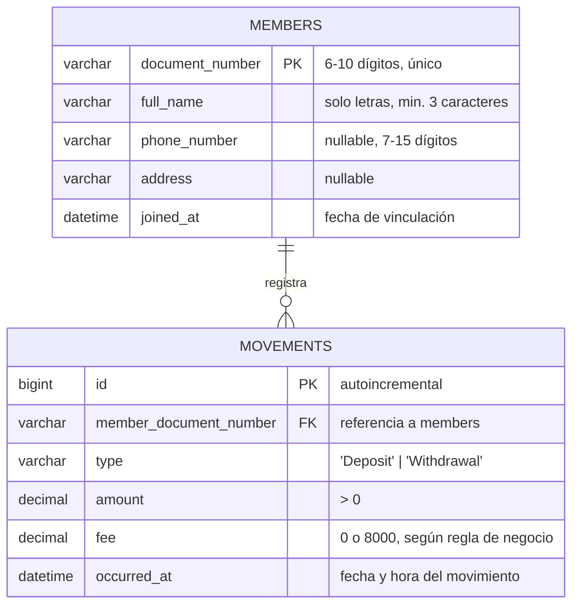

# Modelo de base de datos

**Norma:** 220501095 — Evidencia 4

> Ver la nota en el [README de esta carpeta](../README.md#nota-sobre-el-modelo-de-base-de-datos): la aplicación entregada persiste en memoria (`InMemoryMemberRepository`). Este documento diseña el modelo relacional que respaldaría la misma solución si `IMemberRepository` se implementara contra una base de datos, manteniendo exactamente las mismas reglas de negocio ya validadas en el modelo de objetos (`Member`/`Movement`).

## Identificación de entidades

| Entidad | Corresponde a | Descripción |
|---|---|---|
| **members** | `Member` | Un asociado y su información de contacto. |
| **movements** | `Movement` | Un movimiento (consignación o retiro) de un asociado. |

No hay una tabla para `MovementType`: por ser un enumerado de solo dos valores fijos y estables (Deposit/Withdrawal), se modela como una columna acotada (`CHECK`/`ENUM`) en vez de una tabla de catálogo aparte — evita un JOIN innecesario en cada consulta de movimientos.

## Diagrama entidad-relación



## Relación y multiplicidad

- **members (1) — movements (0..N)**: un asociado puede tener cero o muchos movimientos; todo movimiento pertenece exactamente a un asociado (`member_document_number` es `NOT NULL`). Es la misma multiplicidad 1-a-muchos que ya existe en el modelo de objetos entre `Member` y `Movement` (composición: `_movements` vive dentro de `Member`).
- La llave foránea usa `ON DELETE RESTRICT` (no `CASCADE`): borrar en cascada violaría la regla de negocio "no se puede eliminar un asociado con movimientos registrados" — la base de datos debe rechazar el `DELETE` de un `member` con movimientos, igual que hoy lo rechaza `MemberService.Delete`.

## Atributos principales y por qué

| Columna | Tipo sugerido | Motivo |
|---|---|---|
| `members.document_number` | `VARCHAR(10)` **PK** | Es el identificador natural del asociado en el negocio real (así lo trata `Member.DocumentNumber` en el código); se usa como PK en vez de un `id` sustituto porque el documento ya es único e inmutable por regla de negocio. |
| `members.full_name` | `VARCHAR(150)` | Suficiente para nombres compuestos colombianos; la validación de "solo letras" vive en la capa de aplicación, igual que hoy. |
| `movements.id` | `BIGINT` **PK**, autoincremental | Un movimiento no tiene un identificador natural (dos consignaciones del mismo valor el mismo segundo son eventos distintos); se necesita una clave sustituta. |
| `movements.amount`, `movements.fee` | `DECIMAL(15,2)` | Dinero nunca se modela con punto flotante (`float`/`double`) por errores de redondeo; se usa el mismo tipo `decimal` que ya usa `Movement.Amount`/`Fee` en C#. |
| `movements.type` | `VARCHAR(10)` con `CHECK (type IN ('Deposit','Withdrawal'))` | Refleja el `enum MovementType` sin necesitar tabla de catálogo aparte. |

## Reglas de negocio que la base de datos NO debe re-implementar

El saldo (`Balance`), la comisión condicional y el rechazo de retiros que dejarían el saldo en negativo **siguen viviendo en la capa de aplicación** (dentro de la futura implementación de `IMemberRepository` + `Member`), no como triggers o procedimientos almacenados. Calcular `SUM(amount con signo)` para el saldo se puede hacer con una vista (`member_balances`, más abajo) para lectura rápida en reportes, pero la fuente de verdad de si un retiro se acepta sigue siendo el modelo de dominio en C#, para no duplicar la misma regla en dos lenguajes distintos (SQL y C#) con riesgo de que diverjan.

```sql
-- Vista de solo lectura para acelerar los informes gerenciales (no reemplaza la validación en C#)
CREATE VIEW member_balances AS
SELECT
    m.document_number,
    m.full_name,
    COALESCE(SUM(
        CASE mv.type
            WHEN 'Deposit' THEN mv.amount
            WHEN 'Withdrawal' THEN -(mv.amount + mv.fee)
        END
    ), 0) AS balance
FROM members m
LEFT JOIN movements mv ON mv.member_document_number = m.document_number
GROUP BY m.document_number, m.full_name;
```

El script completo, ejecutable, está en [`schema.sql`](schema.sql).
